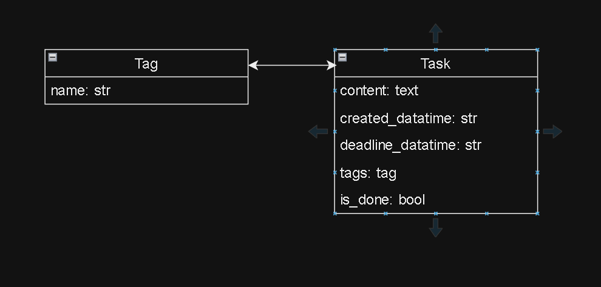

# ToDoList
ToDo List is a powerful web application designed to help you manage your tasks effectively. With ToDo List, you can easily track your tasks, mark them as completed, set deadlines, and organize them into categories.

# Features
* User-friendly interface for creating, updating, and deleting tasks
* Ability to mark tasks as completed or incomplete
* Set deadlines for tasks to prioritize your work
* Categorize tasks into different lists for better organization
* Secure authentication system to protect your data
* Responsive design for seamless access on all devices

# Quick Start
To get started with ToDo List, follow these simple steps:

## Prerequisites
Make sure you have Python 3 installed on your system.

## Installation
1. Clone the repository:
```shell
git clone https://github.com/Anna728560/ToDoList.git
```

2. Navigate to the project directory:
```shell
cd ToDoList
```

3. Create a virtual environment and activate it:

For macOS/Linux:
```shell
python3 -m venv venv
source venv/bin/activate
```

For Windows:
```shell
python -m venv venv
venv\Scripts\activate
```

4. Install dependencies:
```shell
pip install -r requirements.txt
```

5. Apply database migrations:
```shell
python manage.py migrate
```

6. Collect static files:
```shell
python manage.py collectstatic
```

7. Run the development server:
```shell
python manage.py runserver
```

# Project structure


# Demo


# Usage
* Navigate to the homepage to view your tasks.
* Use the navigation menu to create new tasks, update existing tasks, or delete tasks.
* Mark tasks as completed or incomplete by clicking on the corresponding button.
* Set deadlines for tasks to stay organized and prioritize your work.
* Create multiple lists to categorize your tasks based on different criteria.

# Contributing
Contributions are welcome! If you encounter any bugs or have suggestions for improvements, please open an issue on GitHub or submit a pull request.

# Acknowledgments
* Built with Django, HTML/CSS, and Python.
* Special thanks to the Django community for their invaluable contributions and support.